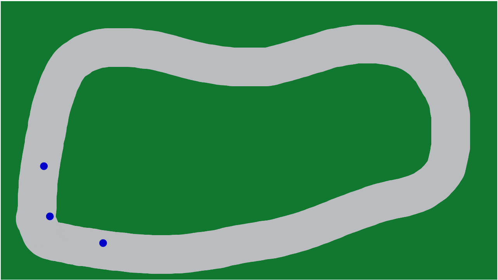

# path-follower
Find a demo here: https://harvdennis.github.io/path-follower/

1. Draw out a path
2. click on the path to spawn a dot which follows the path
3. refresh to draw a new path

please feel free to contribute to this repo to add any extra features.

### Refrences

I used this [article](https://natureofcode.com/book/chapter-6-autonomous-agents/#chapter06_section7) from Dan Shiffman which shows the fundamentals of path following.
